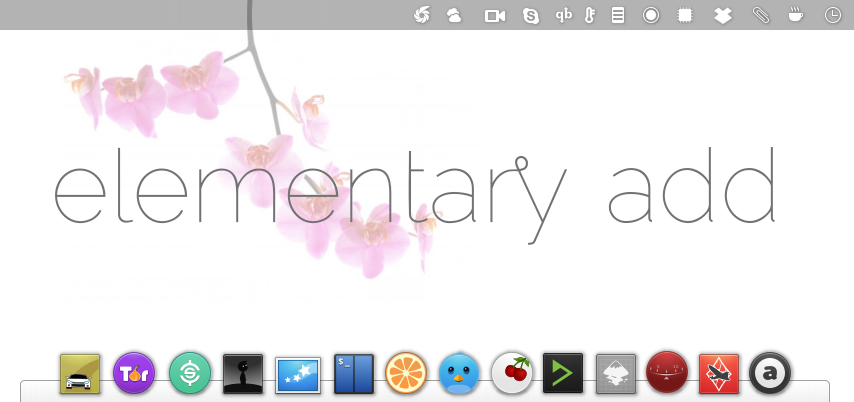
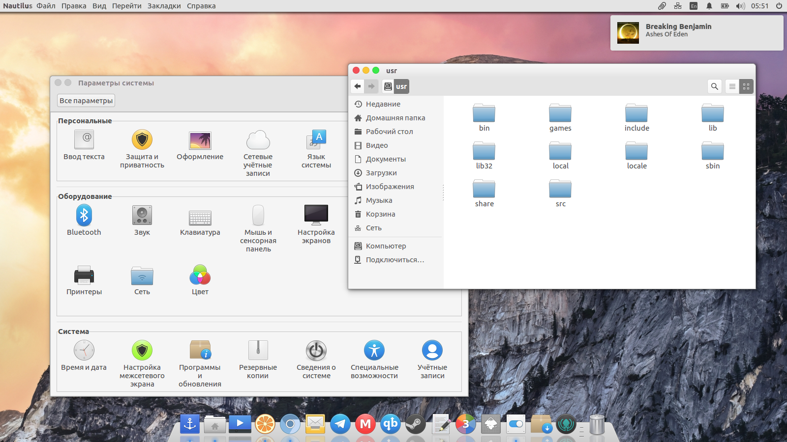

# elementary add icon theme




## Description
elementary style icon themes.

## Install
Support elementary OS and Ubuntu Unity.
```
sudo add-apt-repository ppa:varlesh-l/ppa-elementary-add
sudo apt-get update
sudo apt-get install elementary-add-icon-theme
```
