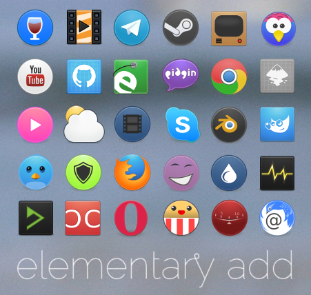
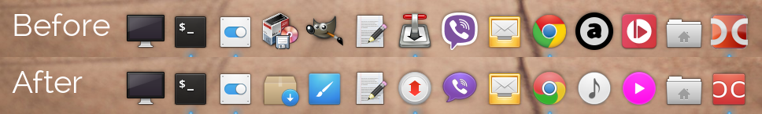

# elementary-add icon theme
Community additional icons for the elementary OS theme. It contains icons for several third party applications that resemble elementary OS's style.



## Intention
This project is a fork [elementary+](https://github.com/mank319/elementaryPlus).
Only SVG-icons!

## Install
```
cd /tmp
git clone https://github.com/varlesh/elementary-add.git
mkdir ~/.icons
cp -R elementary-add/elementary-add ~/.icons/elementary-add
# Fix size icons on slingshot and apply
gsettings set org.pantheon.desktop.slingshot icon-size 48
gsettings set org.pantheon.desktop.slingshot columns 4
gsettings set org.gnome.desktop.interface icon-theme elementary-add
```
