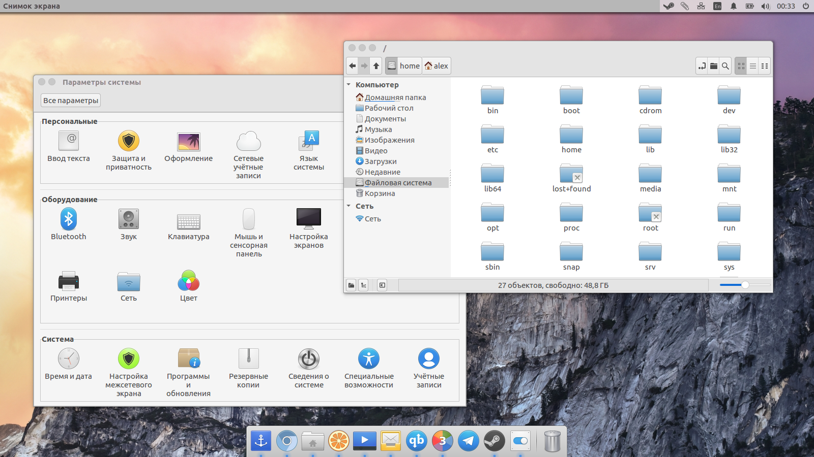

# elementary add icon theme




## Description
Additional icons for elementary OS Freya. It contains icons for several third party applications that resemble elementary OS's style.

## Install
Support elementary OS and Ubuntu Unity.
```
sudo add-apt-repository ppa:varlesh-l/ppa-elementary-add
sudo apt-get update
sudo apt-get install elementary-add-icon-theme
```
