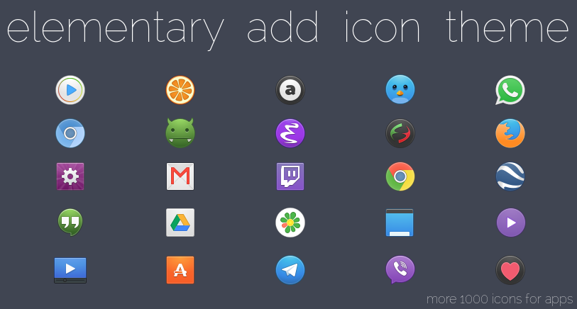

# elementary add icon theme



See [screenshots](https://github.com/varlesh/elementary-add/tree/master/screens)

## Install
Support elementary OS and Ubuntu Unity.
```
sudo add-apt-repository ppa:varlesh-l/ppa-elementary-add
sudo apt-get update
sudo apt-get install elementary-add-icon-theme
```
## Recommends
On elementary OS for better looking please use 48px icons on slingshot-launcher:
```
gsettings set org.pantheon.desktop.slingshot icon-size 48
```
